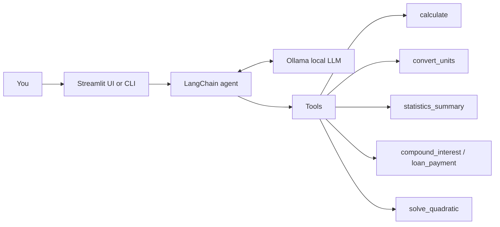

## Smart Calculator Agent


## Features

- **Natural-language math**: "What's 15% tip on $86.40 split 3 ways?"
- **Six tools**: expressions, unit conversion, statistics, compound interest, loan payments, quadratic equations
- **Safe evaluator**: expressions are parsed with a whitelisted AST. `eval()` is never used
- **Conversation memory**: follow-ups like "now divide that by 4" work
- **Transparent**: see every tool call, its arguments and its result
- **Two interfaces**: Streamlit web UI and a terminal CLI
- **Model-agnostic**: any Ollama model that supports tool calling
- **Tested**: unit tests for every tool, with no LLM required

## How it works



1. Your question goes to the agent, which is a local LLM served by Ollama.
2. The model chooses a tool and its arguments.
3. The tool computes the exact result in plain Python.
4. The model explains the result in a short answer.

## Requirements

- Python 3.10+
- [Ollama](https://ollama.com/download)
- A tool-calling model (default: `qwen2.5:7b`, about 5 GB download)

## Quick start

### Windows (PowerShell)

```powershell
winget install Ollama.Ollama        # then reopen PowerShell
ollama pull qwen2.5:7b

git clone https://github.com/<your-username>/smart-calculator-agent.git
cd smart-calculator-agent

py -m venv .venv
.\.venv\Scripts\Activate.ps1
pip install -e ".[dev,ui]"

calc-ui                             # web UI at http://localhost:8501
```

Or run everything in one go: `powershell -ExecutionPolicy Bypass -File .\setup.ps1`

> If activation is blocked, run `Set-ExecutionPolicy -Scope CurrentUser RemoteSigned` once.
> In cmd.exe, use `.venv\Scripts\activate.bat`.

### macOS / Linux

```bash
# Install Ollama: https://ollama.com/download  (Linux: curl -fsSL https://ollama.com/install.sh | sh)
ollama pull qwen2.5:7b

git clone https://github.com/<your-username>/smart-calculator-agent.git
cd smart-calculator-agent

python3 -m venv .venv
source .venv/bin/activate
pip install -e ".[dev,ui]"

calc-ui
```

## Usage

### Web UI

```bash
calc-ui
# or: streamlit run src/calc_agent/app.py
```

The sidebar lets you pick any installed Ollama model, adjust temperature, toggle tool-call details, clear the chat, and try example questions.

### Command line

```bash
calc-agent                                        # interactive chat with memory
calc-agent -v                                     # also show tool calls
calc-agent "What is 15% of 86.40, split 3 ways?"  # one-shot question
calc-agent -m llama3.1:8b "Convert 72 F to C"     # choose a model
python -m calc_agent                              # without the launcher
```

### Example questions

- `Invest 10000 at 7% for 15 years, adding 200 a month. What's the final balance?`
- `Monthly payment on a 250000 loan at 6.5% over 30 years?`
- `Mean and standard deviation of 12, 15, 9, 22, 18`
- `Solve 2x^2 - 4x - 6 = 0`
- `Convert 72 F to C, then 2.5 km to feet`
- `sqrt(2) * sin(pi/4) + log10(1000)`

## Tools

| Tool | What it does |
|---|---|
| `calculate` | Evaluates expressions: `+ - * / // % **`, parentheses, `pi`/`e`/`tau`, `sqrt`, `log`, trig, `factorial`, `gcd`, `lcm`, `round`, `min`/`max`, and more |
| `convert_units` | Length, mass, volume, time, data and temperature |
| `statistics_summary` | Count, sum, mean, median, mode, min, max, range, standard deviations |
| `compound_interest` | Investment growth, with optional monthly contributions |
| `loan_payment` | Fixed monthly payment, total paid and total interest |
| `solve_quadratic` | Real and complex roots of `ax² + bx + c = 0` |

## Configuration

Copy `.env.example` to `.env` and edit it:

```env
OLLAMA_MODEL=qwen2.5:7b
OLLAMA_BASE_URL=http://localhost:11434
OLLAMA_TEMPERATURE=0
```

| Variable | Default | Description |
|---|---|---|
| `OLLAMA_MODEL` | `qwen2.5:7b` | Model used by the agent |
| `OLLAMA_BASE_URL` | `http://localhost:11434` | Where Ollama is running (set this for a remote machine) |
| `OLLAMA_TEMPERATURE` | `0` | Keep at 0 for the most reliable tool use |

### Choosing a model

The model **must support tool calling**.

| Model | Notes |
|---|---|
| `qwen2.5:7b` | Default. Good balance of speed and tool-use reliability |
| `llama3.1:8b` | Solid alternative |
| `qwen3:8b` | Reasoning model. `<think>` blocks are stripped from answers |
| `qwen2.5:14b` | More reliable on multi-step word problems, needs more RAM |
| `llama3.2:3b` | Fast and light, but less reliable |

## Troubleshooting

| Problem | Fix |
|---|---|
| `Cannot reach Ollama` | Start the Ollama app, or run `ollama serve` |
| `Model ... is not installed` | `ollama pull <model>` |
| `does not support tools` | Use a tool-capable model (see the table above) |
| Ignores tools or gives wrong answers | Try a larger model, and keep `OLLAMA_TEMPERATURE=0` |
| Slow first answer | The model is loading into memory. Later answers are faster |
| `calc-agent` / `calc-ui` not found | Activate the virtual environment, or use `python -m calc_agent` / `streamlit run src/calc_agent/app.py` |
| Port 8501 in use | `calc-ui --server.port 8502` |
| Streamlit asks for an email | Press Enter to skip |
